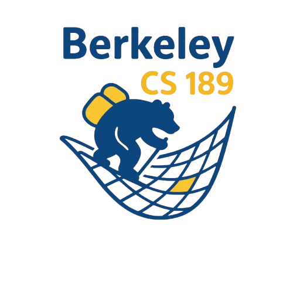

# CS 189/289A: Introduction to Machine Learning

## Course Description

Machine learning is at the core of modern artificial intelligence, transforming how we approach problems in vision, language, robotics, recommendation systems, and countless other areas. EECS 189/289A introduces the theoretical foundations, algorithms, and applications of machine learning, combining mathematical rigor with practical experience. The course explores the full machine-learning pipeline, from problem formulation and working with data to designing and optimizing models. Topics include probability and optimization, clustering and latent-variable models, dimensionality reduction, regression and classification, neural networks, and modern deep-learning architectures.

## [Fall 2026 Frequently Asked Questions](/fa26/faq/)

## Offerings

1. [Fall 2026](/fa26/)
1. [Spring 2026](/sp26/)
1. [Fall 2025](/fa25/)
<!--
1. [Fall 2024](/fa24/)
1. [Spring 2024](/sp24/)
1. [Fall 2023](/fa23/)
1. [Spring 2023](/sp23/)
1. [Fall 2022](/fa22/)
1. [Spring 2022](/sp22/)
1. [Fall 2021](/fa21/)
1. [Spring 2021](/sp21/)
1. [Fall 2020](/fa20/)
1. [Spring 2020](/sp20/)
-->
1. [Fall 2019](/fa19/)
<!--
1. [Spring 2019](/sp19/)
1. [Fall 2018](/fa18/)
-->
1. [Spring 2018](/sp18/)
1. [Fall 2017](/fa17/)

## Goals

- **Provide** a rigorous foundation in the mathematics, algorithms, and concepts of machine learning.

- **Prepare** students for advanced coursework and research in artificial intelligence, deep learning, computer vision, and natural language processing.

- **Enable** students to implement machine-learning algorithms and apply them to real-world problems.

## Prerequisites

CS 189/289A assumes strong preparation in mathematics and programming. The required prerequisites are:

1. **Multivariable calculus:** MATH 53.

1. **Linear algebra:** MATH 54 or equivalent.

1. **Probability and discrete mathematics:** COMPSCI 70 or equivalent.

You should be comfortable with vector calculus (including gradients and the multivariate chain rule), matrix operations, probability theory (including conditional probability and Bayes’ rule), and writing/debugging complex programs in Python. If you lack preparation in these areas, you are likely to struggle.
